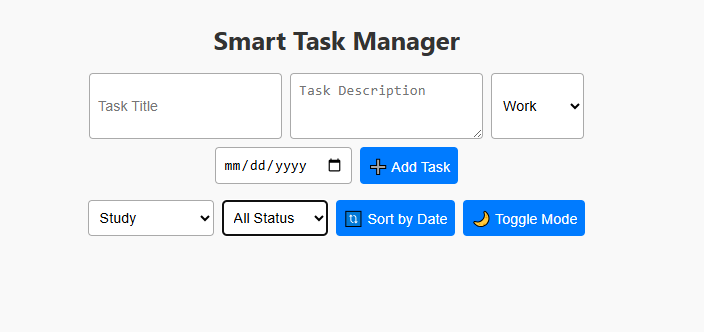

# 🧠 Smart Task Manager

A **Web Technology Project** built using **HTML**, **CSS**, and **JavaScript** to help users manage their tasks efficiently. It allows adding tasks with titles, descriptions, categories, and due dates, and provides useful filtering, sorting, and visual customization options.

---

## 📌 Features

- ✅ Add tasks with:
  - Title
  - Description
  - Category (Work, Personal, Study)
  - Due Date

- 📂 Filter tasks by:
  - Category
  - Completion status (Pending or Completed)

- 📅 Sort tasks by due date (ascending/descending)

- 🌙 Toggle between **Light Mode** and **Dark Mode**

- 🧠 Mark tasks as completed or delete them

- 💾 **LocalStorage** support — tasks are saved even after browser is closed

- 📱 Fully responsive and mobile-friendly UI

---

## 📸 Preview

> 


---

## 🚀 How to Run the Project

1. Clone the repository:
   ```bash
   git clone https://github.com/sangam-star/Task_manager.git
